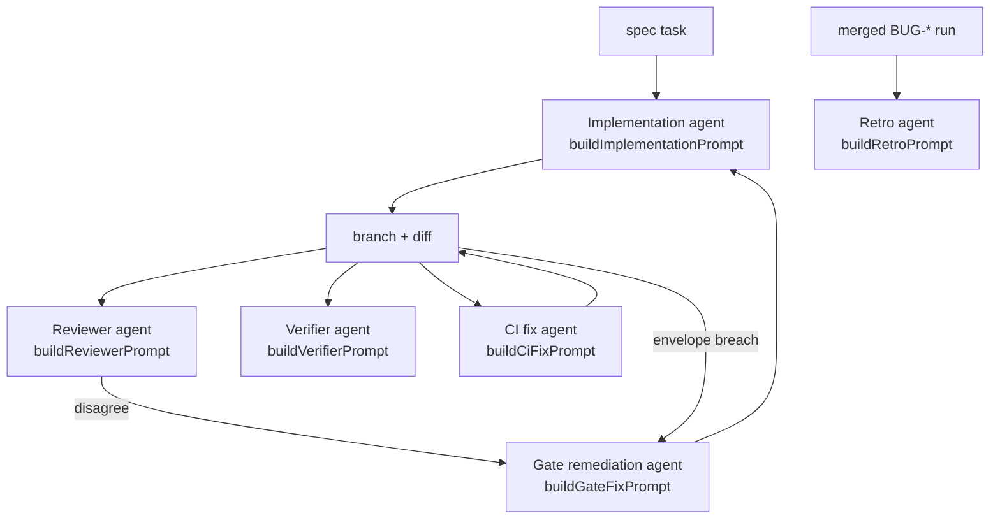

# Agent roles

Which agent roles the engine actually dispatches, what each one is given, and how
that set differs from the fuller team of roles the automated-SDLC vision describes.

The distinction is the point of this document. An aspiration recorded in a PRD reads
identically to a shipped feature when both are prose, and mistaking one for the
other leads to operators waiting for a strategist that does not exist.

Source: `src/utils/*-prompt.ts` and the services that dispatch them, in
[`sdlc-workflow/src`](https://github.com/Rosetta-Foundation/rosetta_dev-scripts/tree/main/sdlc-workflow/src).

## What exists: six prompt-built roles

Every agent the engine spawns is one of these six. Each is a pure prompt-builder
function plus a dispatch site, which is why they are the cheapest part of the engine
to inspect — read the builder and you have read the entire role.

### Implementation agent

**Given:** one spec task (title, engineering notes, acceptance criteria), the
blast-radius envelope quoted verbatim, and the repo's own conventions.

**Runs in:** an isolated git worktree at `<run>/worktrees/<taskId>/`, with a
sanitized environment so it cannot inherit the parent's agent-specific variables.
That sanitation is not hygiene — an inherited `CURSOR_AGENT=1` once made dispatched
agents silently change behaviour.

**Produces:** commits on `sdlc/<runId>/<taskId>`.

The envelope is quoted into the prompt even though the envelope gate enforces it
independently, so the agent can stay in bounds by intent rather than discovering the
boundary by breaching it.

### Reviewer agent

**Given:** the diff, the spec task, the envelope, and the repo's optional
`.sdlc/review-checklist.md`. **Not given:** the implementation agent's conversation
state.

**Produces:** schema-validated JSON — `concur` or `disagree` with cited reasons,
plus per-checklist-item findings when a checklist is present.

Independence here is structural rather than requested. A reviewer prompted with the
implementer's reasoning inherits its blind spots, so the prompt is built from
artifacts only. The upstream prompt is deliberately domain-neutral; a consumer's
domain rules arrive through the checklist seam
([ADR-0009](../ADR-0009-platform-boundary-mechanism-vs-policy.md) §3).

### Verifier agent

**Given:** one `agent:`-tier acceptance criterion, the task heading, and the sandbox
health report. Nothing else — same independence property as the reviewer.

**Produces:** a pass/fail verdict for that single criterion, saved as
`<task>-agent-criterion-<n>` evidence.

One dispatch per agent-tier criterion, not one per task. A criterion is the unit
because that is the unit the spec makes a claim about, and it is what lets closeout
tick individual boxes.

### CI fix agent

**Given:** the failing check names and their logs, dispatched in the task worktree.

**Bounded by:** three attempts (`CI_FIX_ATTEMPT_LIMIT`), counted in
`state.ciFixAttempts`, plus the envelope's token budget.

### Gate remediation agent

**Given:** the red gate verdicts, plus **every prior round's findings**, so attempt
N+1 can see what attempt N was already told. Without that carry-forward, repeated
rounds ping-pong: the agent re-proposes something the reviewer already rejected.

**Bounded by:** `state.gateFixAttempts`, persisted so a resume cannot refill it.

Its contract differs from the CI fix agent's in one way that matters: it must never
widen the envelope to satisfy the envelope gate. `maxDiffLines` and
`forbiddenSurfaces` live in the spec, and the spec tree is a forbidden surface for
product tasks, so trimming scope is the only in-bounds response to a size breach.

### Retro agent

**Given:** a completed `BUG-*` run's context, verdicts, and exceptions.

**Produces:** recommendations of the form `{ check, rationale }` — what check would
have caught this bug earlier — committed as `sdlc.retro.v1` and queued for a human.
Never auto-applied.

## Two non-agent inference callers

Worth listing separately because they use a model without being agents: they make a
single JSON-validated completion call rather than driving a session with tools.

| Caller                 | Produces                                        |
| ---------------------- | ----------------------------------------------- |
| `DecomposeService`     | The task graph from a PRD                       |
| `SpecSynthesisService` | The rendered spec, with grounded surface labels |

Both go through `InferenceRepository`, which validates output against a JSON schema
and retries once with the violations quoted back before failing with a typed error.
That single retry is the difference between a schema-invalid model response being a
transient annoyance and being a crashed intake.

## What does not exist

The [automated SDLC vision](https://github.com/Comita-Health/comita_docs/blob/main/prompts/automated-sdlc.md)
describes a team of nine roles. Most are not implemented, and the engine makes no
attempt to fake them.

| Vision role                    | Engine status                                                                                                                                                         |
| ------------------------------ | --------------------------------------------------------------------------------------------------------------------------------------------------------------------- |
| Strategist                     | **Not implemented.** Business-objective fit is a human conversation today.                                                                                            |
| Product Manager                | **Partial, not as an agent.** `decompose` does mechanical decomposition; PRD authorship and scope judgement are human.                                                |
| Principal Architect / Engineer | **Partial, not as an agent.** Architecture constraints reach the implementation agent as repo rules, not through an architect role.                                   |
| Principal UX Designer          | **Not implemented.** No UX artifact enters the spec.                                                                                                                  |
| Principal QA Engineer          | **Partial.** The verifier agent and verification tiers implement the machine-checkable part; distilling stable agent verifications into scripted E2E tests is manual. |
| Documentation / Coherence      | **Partial.** Closeout automates spec truthfulness; nothing audits doc coherence more broadly.                                                                         |
| Operations / Observability     | **Partial.** Heartbeats, monitor logs, and the exception ledger exist; no agent reasons over them.                                                                    |
| Security / Compliance          | **Not implemented as a role.** Enforced structurally instead — forbidden surfaces, the sandbox-only deploy path, and the repo's review checklist.                     |
| Orchestrator                   | **Implemented**, as the engine itself plus the operator agent — not as a prompt-built role.                                                                           |

Two observations that matter more than the table:

**Structural enforcement has repeatedly beaten a role.** The compliance concerns a
Security role would review are instead unreachable by construction: the contract
repository exposes only the sandbox environment, so no code path through the
deployer can reach production, and forbidden surfaces are checked against the
committed tree rather than trusted to reviewer attention. A gate that cannot be
forgotten is worth more than a reviewer who might.

**The unimplemented roles are the ones whose output is judgement, not artifacts.**
Strategy and UX produce a decision that a downstream artifact then encodes; the
implemented roles all consume and produce artifacts the engine can hash, diff, and
cache. That is not a coincidence, and it is a reasonable prediction about which
roles are hard to add.

## Adding a role

The mechanical part is small: a prompt builder in `src/utils/`, a dispatch site in
the service that owns the decision, and evidence written for whatever the agent
concluded. Three requirements are less obvious and each has a failure behind it:

1. **Decide what the role is denied.** Every current agent's independence comes
   from what it is _not_ given. A role built from "everything available" cannot be a
   check on anything.
2. **Bound it, and persist the bound.** Attempts must be counted in `state.json`,
   or a resume grants a fresh budget forever.
3. **Make its output an artifact.** A role whose conclusion is not written as
   evidence or an artifact cannot be cached, audited, or learned from — and it will
   be re-run on every resume.
