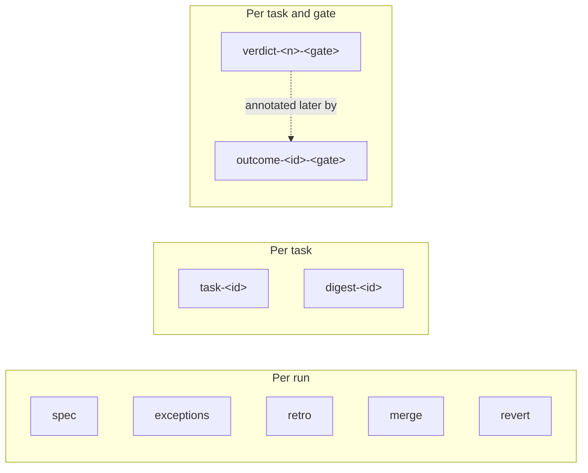

# Chronicle artifact catalog

Every durable output of a run is a versioned JSON artifact committed into a
Chronicle ledger repo. This is the catalog: nine schemas, what each one records,
what writes it, and what reads it back.

Source: [`repositories/chronicle-artifact.repository.ts`](https://github.com/Rosetta-Foundation/rosetta_dev-scripts/blob/main/sdlc-workflow/src/repositories/chronicle-artifact.repository.ts),
[`services/chronicle-commit.service.ts`](https://github.com/Rosetta-Foundation/rosetta_dev-scripts/blob/main/sdlc-workflow/src/services/chronicle-commit.service.ts),
`services/{digest,retro}.service.ts`. Commit conventions per
[ADR-0007](../ADR-0007-chronicle-commit-type.md).

## Layout and envelope

All artifacts for a run live in one directory of the Chronicle repo:

```
<chronicle-repo>/chronicles/sdlc/<runId>/
├── spec.json
├── task-T-01.json
├── task-T-02.json
├── verdict-000-envelope.json
├── verdict-001-reviewer.json
├── verdict-002-phase.json
├── outcome-T-01-reviewer.json
├── exceptions.json
├── digest-T-01.json
├── merge.json
└── retro.json
```

Every artifact shares one envelope, which is what makes the set readable by a
consumer that does not know the specific schema:

```ts
interface ChronicleArtifact {
  schema: ArtifactSchema; // one of the nine 'sdlc.*.v1' values
  runId: string;
  specId: string;
  recordedAt: string; // ISO timestamp
  payload: unknown; // schema-specific
}
```

The `v1` suffix is deliberate and load-bearing: artifacts were versioned from the
first one written, so a later schema change adds `sdlc.thing.v2` alongside rather
than silently changing the meaning of existing files in the ledger.

Filenames are chosen so that re-writing the same logical record overwrites rather
than duplicating. That is what makes a resumed run idempotent against the ledger —
replaying a cached step rewrites the identical artifact instead of appending a
near-duplicate.



## The nine schemas

### `sdlc.spec.v1`

The spec as the run saw it. One per run, file `spec.json`.

```ts
payload: {
  status: SpecStatus;      // 'Draft' | 'Approved' | 'Done' | …
  contentDigest: string;   // digest of the whole spec document
  envelope: Envelope;      // allowedPaths, forbiddenSurfaces, maxDiffLines, budgetK
  tasks: SpecTask[];       // the full task graph
}
```

`contentDigest` is the honesty mechanism: it pins which text of the spec was
actually executed, so a later spec edit cannot retroactively claim to be what the
run implemented.

### `sdlc.task-result.v1`

One per task, file `task-<taskId>.json`. Payload is the `TaskRunResult` verbatim —
status, branch, worktree path, implementation digest, `mergedSha`, `prUrl`. See
[state schema](state-schema.md#taskresults).

### `sdlc.verdict.v1`

One per recorded gate verdict, file `verdict-<nnn>-<gate>.json` (zero-padded index
preserving order).

```ts
payload: {
  gate: string;
  inputsDigest: string;
  outcome: GateOutcome;      // pass | breach | blocked | human-required
  wouldEscalate: boolean;
  reasons: string[];
  evidenceRefs: string[];    // resolvable evidence artifact IDs
  taskId: string;            // 'run' when not task-scoped
}
```

This is the gate-policy contract: it is what `check-veto` and any later
gate-precision analysis read. `evidenceRefs` point at the run's `evidence/` files
so a verdict is never an unsupported assertion.

### `sdlc.outcome.v1`

What eventually _happened_ to a recorded verdict, file
`outcome-<taskId>-<gate>.json`.

```ts
payload: {
  taskId: string;
  gate: string;
  verdictInputsDigest: string; // joins back to the verdict artifact
  outcome: "vetoed" | "reworked" | "stood";
}
```

This exists so per-gate precision is computable from the ledger alone: how often a
reviewer concur preceded a human veto, how often a breach was overridden. The dedup
key includes `taskId` because gate names like `envelope` repeat across tasks, and
keying on gate alone silently collapsed distinct tasks into one record.

`reworked` is reserved for a future rework-detection trigger; today the ledger
writes `stood` and `vetoed`.

### `sdlc.exceptions.v1`

One per run, file `exceptions.json`. Payload is the array of `ExceptionEntry` —
every escalation trigger the run raised, with the context strings that were shown
to the human. See [gate model](gate-model.md#the-aggregator) for the trigger set.

### `sdlc.digest.v1`

One per task phase boundary, file `digest-<taskId>.json`. The human-facing summary
of a phase: what merged, on what evidence.

```ts
payload: {
  schema: 'sdlc.digest.v1';
  runId: string; specId: string; taskId: string;
  phaseOutcome: GateOutcome;
  gates: Array<{ gate; outcome; wouldEscalate; reasons; evidenceLinks }>;
  exceptions: ExceptionEntry[];
  merges?: Array<{ taskId: string; mergedSha: string }>;
  closeoutPr?: string;
  postedAt: string;
}
```

A queue item pointing at the digest is appended to the Chronicle inbox, so the
human's review entry point is the ledger rather than a terminal. `merges` carries
every merged task's commit so a veto decision can be made from the digest alone,
and `closeoutPr` links the closeout PR when one exists — absent means "no closeout
yet," not a schema change.

### `sdlc.merge.v1`

One per run, file `merge.json`.

```ts
payload: {
  mergedSha: string;
  approvedBy: string; // 'human' unless overridden
  taskId?: string;
}
```

### `sdlc.revert.v1`

One per veto, file `revert.json`. Records the revert SHA and the vetoed merge, and
triggers `sdlc.outcome.v1` annotation of every verdict in the reverted phase.

### `sdlc.retro.v1`

One per completed `BUG-*` run, file `retro.json`.

```ts
payload: {
  schema: "sdlc.retro.v1";
  runId: string;
  specId: string;
  recommendations: Array<{ check: string; rationale: string }>;
  postedAt: string;
}
```

Bug runs get one inference pass over the run's context, verdicts, and exceptions,
asking what check would have caught this bug earlier. The recommendations become a
queue item — proposals for a human, never auto-applied.

## Failure posture

Artifact writing is loud but non-blocking. A Chronicle commit failure or an
inference failure in the retro path throws to the run handler, which logs and
escalates but does not fail the merge that already happened. A run's value is the
merged code; losing the ledger entry for it is a bug worth waking someone over, not
a reason to pretend the merge did not occur.

The corollary matters for anyone reading a ledger: absence of an artifact is
weaker evidence than the artifact's contents. A run with no `retro.json` may have
had its retro fail, not skipped it by design.
