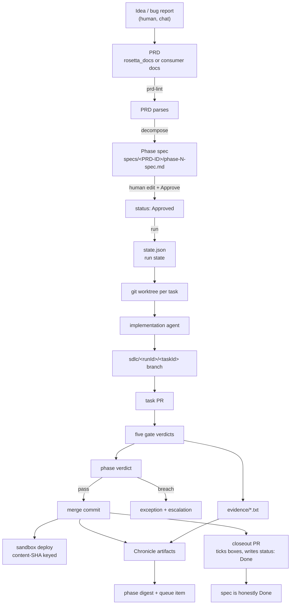

# Data flow

How an idea becomes merged, deployed code with a durable record: PRD → spec →
tasks → PRs → verdicts → merge → sandbox → Chronicle → closeout. This document
follows one artifact chain end to end and names the transformation at each step.

## The chain

## PRD to spec

A PRD is prose with a required structure. `prd-lint` checks it parses before
anything expensive happens — the error names the exact missing or malformed
section, which is cheaper than discovering it inside `decompose`.

`decompose` reads the PRD and produces a phase spec: a task graph where each task
has an id, a title, engineering notes, `dependsOn`, and acceptance criteria, plus a
blast-radius envelope (`allowedPaths`, `forbiddenSurfaces`, `maxDiffLines`,
`budgetK`). The spec format is [ADR-0008](../ADR-0008-implementation-spec-format.md).

Two things about this transformation are worth knowing before you trust its output:

**Surface labels are grounded, not invented.** `SpecSynthesisService` resolves
`forbiddenSurfaces` against the repo's own `.sdlc/surfaces.json` at synthesis time.
A label the repo does not declare is a spec-validation failure at intake rather
than an unresolvable label discovered by the envelope gate mid-run.

**Acceptance criteria carry a tier prefix.** `test:`, `agent:`, `manual:`, or
`docs:` — which decides who closes the criterion. The prefix is validated at
intake, because a criterion with no tier has no defined verifier and would fail at
the moment of verification instead of the moment of authorship.

The spec is then a human artifact: edited by hand, and flipped to
`status: Approved` by a person. `run` refuses a spec that is not Approved. That
refusal is the single human authorization point for the whole machine.

## Spec to tasks

`run` writes `state.json` before intake completes, so a crash never leaves a run
that `status` cannot describe. From there:

1. `ExecutorService` selects every task whose `dependsOn` tasks all have a
   `mergedSha`. Merged, not implemented — a task whose dependency is written but
   unmerged would be building on a branch that may still be rejected.
2. Each selected task gets a git worktree under `<run>/worktrees/<taskId>/` and an
   implementation agent, spawned with a sanitized environment so a nested agent
   cannot inherit the parent's agent-specific variables.
3. The agent's prompt carries the task, the envelope, and the repo's conventions —
   see [agent roles](agent-roles.md).
4. The resulting branch is pushed and a PR opened (or rediscovered on resume).

The PR matters structurally, not just socially: it is the subject of the reviewer
gate's published verdict and the CI gate's check runs. No PR means no CI signal.

## Tasks to verdicts

Five gates judge the branch, each reading a different input:

| Gate         | Reads                                                       |
| ------------ | ----------------------------------------------------------- |
| envelope     | `git diff` base…head, the envelope, `surfaces.json` at head |
| reviewer     | the diff, the task, the envelope, `review-checklist.md`     |
| sandbox      | `environments.json` → sandbox; deploy and health output     |
| verification | acceptance criteria by tier; `verification.json`            |
| ci           | GitHub check runs for the pushed SHA                        |

Each verdict is recorded in `state.verdicts` and cached by
`name:taskId:inputsDigest`. Anything a gate learned from a subprocess or an agent
is written to `<run>/evidence/<id>.txt` and referenced by id, so a verdict is
always resolvable back to what produced it. Details in
[gate model](gate-model.md).

## Verdicts to merge

The aggregator combines the five into one `phase` verdict. Green merges; red
records exceptions and halts the task by leaving it unmerged, which is exactly what
blocks its dependents. There is no code path that merges on red.

A merge is recorded as `mergedSha` on the task result — read back from the remote,
because `gh`'s merge SHA is remote-only and reading it from a local ref returns the
wrong commit.

## Merge to sandbox

The sandbox deploy is keyed on **tree content**, not commit SHA. A merge commit and
the PR head it merged have different commit SHAs and identical trees, so keying on
the commit deployed the same build twice. The deploy ledger records content SHA
alongside commit SHA and reuses a live deploy of the same content; concurrent
triggers for identical content never dispatch twice.

The health check must echo the deployed SHA (`SDLC_SANDBOX_SHA`) so a stale build
answering 200 cannot pass as fresh.

## Everything to the Chronicle

At each phase boundary the run commits its artifacts to the Chronicle ledger repo
under `chronicles/sdlc/<runId>/`, then appends a queue item pointing at the phase
digest. The nine schemas are cataloged in
[Chronicle artifacts](chronicle-artifacts.md).

The direction of that dependency is worth stating: the Chronicle is downstream of
every decision and upstream of none. No artifact influences a verdict. That is what
makes the ledger safe to write loudly and non-blockingly — a failed Chronicle
commit escalates without invalidating the merge it was describing.

## Closeout

The last transformation closes the loop back to the spec.

A spec's checkboxes and `status:` field are a claim about verification, and for
most of the engine's life that claim was hand-maintained — which meant it drifted,
and five landed specs sat with unticked criteria. `closeout` derives the claim
instead:

1. `CloseoutAggregateService` reads the run's recorded criterion verdicts and task
   merges and produces a read-only aggregate: per criterion, whether a passing
   verdict exists; per task, whether it merged and whether its phase gate passed.
2. `applyCloseout` ticks exactly the criteria with a passing verdict, and writes
   `status: Done` only when every criterion passes, every task merged, and every
   phase gate is green.
3. `CloseoutService` commits that edit to a long-lived per-spec branch through the
   single privileged spec-write route and opens (or updates) an idempotent Addi PR
   whose body explains every tick and every remainder.

Two rules keep this honest. **Closeout never unticks a box** — a hand tick is a
human's record of hand verification, and the machine does not get to overrule it —
but an unverified pre-existing tick does not count toward `status: Done` either, and
the PR body lists it. And **closeout is the only writer into `specs/**`**;
everything else editing a spec path is an envelope breach, pinned by a static test
asserting the privileged method has exactly one caller.

The supervisor will not report a phase complete until the closeout PR exists and is
open or merged, so the documentation cannot silently lag the code.
