# Engine architecture

How the SDLC engine is put together: the subsystems, which layer each class sits
in, and the path a CLI command takes to reach a gate verdict.

Source: [`rosetta_dev-scripts/sdlc-workflow/src`](https://github.com/Rosetta-Foundation/rosetta_dev-scripts/tree/main/sdlc-workflow/src).

## The shape of it

The engine is a single Node CLI following the mandatory Handler / Service /
Repository pattern with InversifyJS constructor injection. Dependency direction is
strictly one-way, so the interesting consequence for reading the code is that
**anything touching the outside world is a repository**: git, `gh`, the filesystem,
model APIs, spawned agents. Services hold judgement and orchestration and are
therefore unit-testable with no network and no git. Two handlers are the only
entry points.

`src/index.ts` is the composition root and the yargs CLI in one file — it binds
all 49 tokens and contains no business logic.

```mermaid
graph TD
    CLI["src/index.ts<br/>CLI + composition root"]

    subgraph Handlers
        WH["WorkflowHandler<br/>prd-lint · spec-lint · decompose"]
        RH["RunHandler<br/>run · queue-run · record-merge · closeout · status"]
    end

    subgraph "Planning services"
        DEC[DecomposeService]
        SYN[SpecSynthesisService]
    end

    subgraph "Execution services"
        SUP[SuperviseService]
        EXE[ExecutorService]
        RET[RetryExecutorService]
        REM[GateRemediationService]
    end

    subgraph "Gate services"
        ENV[EnvelopeGateService]
        REV[ReviewerGateService]
        SBX[SandboxDeployService]
        VER[VerificationService]
        CIG[CiGateService]
        AGG[AggregatorService]
    end

    subgraph "Ledger services"
        CHR[ChronicleCommitService]
        DIG[DigestService]
        ESC[EscalationService]
        RTR[RetroService]
        CLO["CloseoutService<br/>+ CloseoutAggregateService"]
    end

    subgraph "Repositories (the only outside world)"
        GIT[GitRepository]
        PR[PullRequestRepository]
        CI[CiStatusRepository]
        RS[RunStateRepository]
        EV[EvidenceRepository]
        CON["ContractRepository<br/>SurfaceMapRepository<br/>ReviewChecklistRepository"]
        AG["AgentRunnerRepository<br/>CursorCliRepository"]
        INF["InferenceRepository<br/>ModelRepository<br/>Anthropic · OpenAI"]
        WAKE["WakeInboxRepository<br/>QueueRepository · IssueRepository"]
        CA[ChronicleArtifactRepository]
    end

    CLI --> WH
    CLI --> RH
    CLI --> SUP

    WH --> DEC
    WH --> SYN
    DEC --> INF
    SYN --> INF
    SYN --> CON

    SUP --> RH
    RH --> EXE
    RH --> REM
    RH --> RET
    EXE --> AG

    RH --> ENV
    RH --> REV
    RH --> SBX
    RH --> VER
    RH --> CIG
    RH --> AGG

    REV --> AG
    VER --> AG
    CIG --> AG
    CIG --> CI
    SBX --> CON
    ENV --> CON

    RH --> CHR
    RH --> DIG
    RH --> ESC
    RH --> RTR
    RH --> CLO

    ENV --> GIT
    RH --> GIT
    RH --> PR
    RH --> RS
    RH --> EV
    ESC --> WAKE
    SUP --> WAKE
    CHR --> CA
    CLO --> PR
```

## Subsystems, and what each one is for

**Planning** turns prose into a machine-readable spec. `DecomposeService` reads a
PRD and produces the task graph; `SpecSynthesisService` renders the spec document
including the blast-radius envelope, grounding surface labels against the repo's
own `.sdlc/surfaces.json`. Both reach a model through `InferenceRepository`, which
is the only place in the engine that validates model output against a JSON schema
and retries once on a schema violation.

**Execution** dispatches implementation work and decides whether to try again.
`ExecutorService` selects the next eligible task (dependencies must be _merged_,
not merely implemented) and spawns the implementation agent in a git worktree.
`RetryExecutorService` is the shared bounded-retry policy for non-gate steps, and
`GateRemediationService` is the bounded re-dispatch when the reviewer disagrees or
the envelope gate breaches. `SuperviseService` wraps `RunHandler` in the wave loop
and owns every process-level exit.

**Gates** are five independent judgements plus one aggregator. Each gate service
returns a `GateVerdict` and never merges, escalates, or writes a spec — the
handler decides what a verdict means. That separation is why gate behaviour is
testable without a repository. See [gate model](gate-model.md).

**Ledger** services write the durable record: Chronicle artifacts, the phase
digest, escalation queue items and issues, the retro, and the closeout docs PR.
None of them influence a verdict; they are all downstream of one.

## Layer rules in practice

The pattern's constraint that services never call other services is real here and
shapes the handler. `RunHandler.taskPipeline` is long because it _is_ the
composition point: it sequences envelope → reviewer → sandbox → verification → CI
→ aggregate itself rather than letting the gates chain to each other. The cost is
a large handler method; the benefit is that no gate can depend on another gate's
side effects, which is what makes the step cache correct on resume.

Two repositories exist purely to keep a trust boundary explicit:

- `SurfaceMapRepository` has two read paths — `load` (the operator's working tree,
  synthesis-time only) and `loadAtRef` (the committed blob at the ref under
  judgement). Gates must use the second, so a locally edited contract cannot sway
  a verdict.
- `SpecFileRepository.writeCloseout` is the single privileged writer into
  `specs/**`. Everything else editing a spec path is an envelope breach by
  construction, and a static test pins that this method has exactly one caller.

## Where state lives

Nothing important lives in memory across a process boundary. One run directory
under `$SDLC_RUNS_DIR` (default `~/.rosetta/sdlc-runs/<run-id>/`) holds:

| Path                | Written by                | Purpose                                                   |
| ------------------- | ------------------------- | --------------------------------------------------------- |
| `state.json`        | `RunStateRepository`      | The whole run's durable state — [schema](state-schema.md) |
| `run.lock`          | `RunStateRepository`      | Single-writer lock; a second process refuses to start     |
| `worktrees/<task>/` | `GitRepository`           | One git worktree per task, where its agent works          |
| `evidence/*.txt`    | `EvidenceRepository`      | Resolvable transcripts referenced by verdicts             |
| `heartbeat.jsonl`   | `HeartbeatService`        | Append-only progress record for liveness detection        |
| `monitor.log`       | `HeartbeatWatchService`   | Human-readable supervisor narration                       |
| `supervise.exit`    | `SuperviseExitRepository` | Terminal exit record, written even on a thrown error      |
| `launch.json`       | `SuperviseService`        | argv, cwd, repo path — what the daemon needs to relaunch  |

State writes are atomic (temp file, fsync, rename) so a kill mid-write cannot
truncate `state.json`, and the run lock means two supervisors cannot interleave
writes to it.

## Adding to the engine

The layer a thing belongs in is usually decided by one question: does it need the
outside world? If yes it is a repository, and the service that uses it takes its
interface. If it is pure computation over data already in hand, it is a function
in `src/utils/` — that is where the prompt builders, the spec parser and renderer,
digesting, and glob matching live, and it is why they are the cheapest code in the
engine to test.

New gates are the one case with a hard extra requirement: a gate must return a
verdict for _every_ input, including "I cannot evaluate this." A gate that throws
where it means `blocked` turns a recoverable stop into a crashed run.
