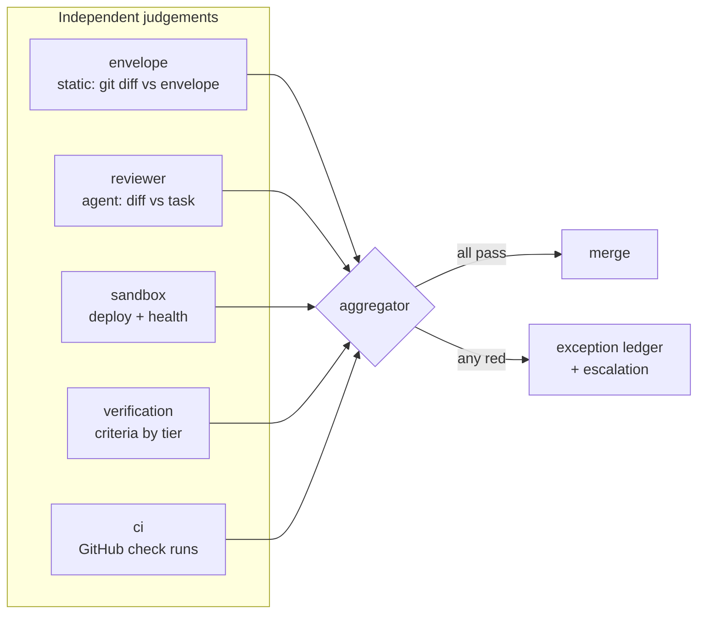

# Gate model

Five gates judge a task, and one aggregator turns their five verdicts into the
single decision that either merges the branch or stops the run. This document is
the per-gate reference: what each one reads, what it can return, what evidence it
leaves, and what happens when it goes red.

Source: `services/{envelope-gate,reviewer-gate,sandbox-deploy,verification,ci-gate,aggregator}.service.ts`
in [`sdlc-workflow/src`](https://github.com/Rosetta-Foundation/rosetta_dev-scripts/tree/main/sdlc-workflow/src/services).

## The verdict type

Every gate returns the same shape, which is what lets the aggregator treat them
uniformly and the step cache store them interchangeably:

```ts
interface GateVerdict {
  gate: string;
  outcome: "pass" | "breach" | "blocked" | "human-required";
  wouldEscalate: boolean;
  reasons: string[];
  evidenceIds?: string[];
  taskId?: string;
  inputsDigest?: string;
  transcript?: string;
  recordedAt: string;
}
```

The four outcomes are not interchangeable, and the distinction between two of them
carries most of the engine's operational behaviour:

| Outcome          | Means                                                               |
| ---------------- | ------------------------------------------------------------------- |
| `pass`           | This gate is satisfied                                              |
| `breach`         | This gate is violated — the diff is wrong, not the evidence missing |
| `blocked`        | The gate could not reach a judgement (no signal, no contract)       |
| `human-required` | Only a human can close this — manual- or docs-tier criteria         |

`wouldEscalate` is separate from `outcome` on purpose. A gate can be `blocked`
without escalating — the canonical case is a repo that declares no sandbox
contract, where `blocked` + `wouldEscalate: false` means "not applicable here"
rather than "broken." That asymmetry is what lets "merged implies deployed" hold
for repos with a sandbox without failing every task in repos without one.



## Envelope gate

**Reads:** the git diff between the task's integration tip and its branch head;
the blast-radius envelope from the spec; `.sdlc/surfaces.json` **as committed at
the head ref under judgement**.

**Returns:** `pass`, or `breach` with one reason per violated rule. Never
`blocked` — a missing surface contract is reported as a breach reason naming the
unresolvable labels, not as an inability to judge.

Four independent checks, any of which breaches:

1. **Paths outside `allowedPaths`.**
2. **Any `specs/**` edit** — forbidden mid-run even when `allowedPaths` covers it,
   because a task that can tick its own acceptance criteria can certify itself.
   Closeout is a separate docs PR with a separate privileged write route.
3. **Forbidden surfaces touched**, resolved through the repo's surface map. An
   unresolvable label is itself a breach: fail closed, never treat an unknown
   label as unrestricted.
4. **Non-test diff lines over `maxDiffLines`.** Test files (`*.test.*`,
   `*.spec.*`, `__tests__/**`, `__mocks__/**`) are exempt from the budget, so a
   large but well-tested diff is not penalized for its tests.

**Retrigger:** a breach re-dispatches the implementation agent to trim scope,
bounded by `state.gateFixAttempts`. `maxDiffLines` is never auto-raised.

**Trust boundary:** the contract is read from the committed blob at the head ref,
never the operator's working tree, so a locally edited `surfaces.json` cannot sway
a verdict.

## Reviewer gate

**Reads:** the diff, the spec task (title, engineering notes, acceptance
criteria), the envelope, and the repo's optional `.sdlc/review-checklist.md`.
Deliberately _not_ the implementation agent's conversation state — independence is
structural, not requested.

**Returns:** `pass` on `concur`, `breach` on `disagree`, with the reviewer's cited
reasons. The full assessment JSON is saved as evidence
(`<task>-reviewer-transcript`).

**Model contract:** the reviewer's output is schema-validated —
`{ decision: 'concur' | 'disagree', reasons: string[] }` plus per-checklist-item
findings when a checklist is present. Invalid output is retried once with the
violations quoted back, then fails as a typed error.

**Published to the PR:** the gate marks a pending commit status before dispatch
and publishes the verdict as a status plus a comment, so a human reading the PR
sees the same judgement the engine acted on. Publication is skipped when the gate
is satisfied from the step cache, which keeps a resume from re-spamming the PR.

**Retrigger:** disagreement re-dispatches the implementation agent with the
reviewer's concerns as input, bounded by `state.gateFixAttempts`. This was the
single largest terminal class before it became remediable — 14 disagreements
stopped runs cold in the measured corpus.

## Sandbox gate

**Reads:** `.sdlc/environments.json` → the `sandbox` entry only. There is
deliberately no API to fetch any other environment, so no code path through the
deployer can reach production.

**Returns:**

| Situation                        | Outcome   | `wouldEscalate` |
| -------------------------------- | --------- | --------------- |
| Deploy + health green            | `pass`    | `false`         |
| No sandbox contract in the repo  | `blocked` | `false`         |
| Deploy command failed            | `breach`  | `true`          |
| Health check failed or wrong SHA | `breach`  | `true`          |

**Health protocol:** the health command's output must contain the deployed SHA
verbatim (`SDLC_SANDBOX_SHA`). A health check that returns 200 for a stale build
is a false green, and requiring the SHA in the output is what makes the check
content-level rather than liveness-level.

**Idempotence:** two layers. Per SHA, a SHA already recorded healthy skips the
deploy command and re-verifies health only. Per _content_, when a deploy ledger is
available, content already live under a different commit is reused — a merge commit
and the PR head it merged have different commit SHAs and the same tree — and
content another trigger is already deploying is never dispatched twice.

**Evidence:** the health output is saved as `<task>-sandbox-health`. When a
repo-owned deploy script echoes a GitHub Actions run URL, the ledger records it so
the artifact points at the actual deploy.

## Verification gate

**Reads:** the task's acceptance criteria, each carrying a tier prefix per
[ADR-0008](../ADR-0008-implementation-spec-format.md); `.sdlc/verification.json`
for the scripted-check command; the sandbox health report for agent-tier context.

**Tiers and who closes them:**

| Prefix    | Closed by                                         | Verdict on success |
| --------- | ------------------------------------------------- | ------------------ |
| `test:`   | The repo's `testCommand` (scripted check)         | `pass` / `fail`    |
| `agent:`  | An independent verifier agent driving the sandbox | `pass` / `fail`    |
| `manual:` | A human                                           | `human-required`   |
| `docs:`   | A human, via the closeout docs PR                 | `human-required`   |

**Aggregation:** any failing criterion makes the gate `breach`; otherwise any
human-required criterion makes it `human-required`; otherwise `pass`. Only actual
failures set `wouldEscalate`, so a spec full of manual criteria does not spam
escalations — it just cannot merge without a human.

**A missing verification contract does not fail the run.** With no
`testCommand`, test-tier criteria degrade to `human-required`, because the engine
cannot distinguish "this repo has no scripted checks" from "this criterion is
unmet."

**Evidence:** per-criterion — `<task>-test-output` for the scripted check,
`<task>-agent-criterion-<n>` for each agent-tier verdict. Criterion verdicts are
recorded individually in `state.criterionVerdicts`, which is what makes automated
[closeout](data-flow.md#closeout) possible: the closeout PR ticks exactly the
boxes with a recorded passing verdict.

## CI gate

**Reads:** GitHub check runs for the pushed head SHA, via `gh`.

**Returns:**

| Situation                                         | Outcome   | Reason                                 |
| ------------------------------------------------- | --------- | -------------------------------------- |
| All check runs green                              | `pass`    | `<n> check runs green for <sha>`       |
| No results after the appear window (~5 min)       | `blocked` | branch not pushed, or `gh` unavailable |
| Zero check runs after the appear window           | `blocked` | commit has no check runs               |
| Still pending at the deadline (~15 min)           | `blocked` | names each pending check               |
| Failing checks, fix budget exhausted (3 attempts) | `breach`  | names each failing check               |
| Failing checks, token budget exhausted            | `breach`  | spend exceeds envelope `budgetK`       |
| Failing checks, budget remains                    | —         | dispatches a fix agent and re-polls    |

**Waiting is the whole point.** Every CI block in the measured corpus was missing
signal rather than failing CI: 16 blocked verdicts, all of them `no check runs` or
`no CI results for <sha>`, and zero genuine CI failures. The gate polls for checks
to _appear_ (10 s interval, 5 min window) before polling them to terminal (30 s
interval, 15 min deadline), and the appear window restarts per SHA because a pushed
fix is as new to GitHub as the original push was.

**Retrigger:** failing checks dispatch a fix agent with the failing logs, at most
three attempts (`CI_FIX_ATTEMPT_LIMIT`), counted in `state.ciFixAttempts` so a
resume cannot refill the budget. The whole cycle's log is saved as
`<task>-ci-monitor`.

## The aggregator

**Reads:** the five verdicts, the run state, and the envelope's `budgetK`.

**Returns:** one `phase` verdict — `pass` only when every gate passes (with
sandbox judged by `wouldEscalate`, so "no contract" does not block) — plus
exception-ledger entries.

**Exception triggers:**

| Trigger                     | Raised when                                                          |
| --------------------------- | -------------------------------------------------------------------- |
| `reviewer-disagreement`     | Reviewer outcome is not `pass`                                       |
| `envelope-breach`           | Envelope outcome is `breach`                                         |
| `sandbox-failed`            | A _declared_ sandbox failed to deploy or report healthy              |
| `ci-fix-attempts-exhausted` | `state.ciFixAttempts[task] >= 3`                                     |
| `budget-exhaustion`         | `state.tokenSpendK > envelope.budgetK`                               |
| `merge-blocked`             | A red phase gate blocked an enforced merge (recorded by the handler) |

Each exception becomes an action-required queue item in the Chronicle, a
`needs-human` GitHub issue, and a durable wake — see
[wake and escalation](wake-escalation.md).

## What a gate must never do

Three constraints hold across all five, and violating any of them has broken a run
in practice:

- **A gate never merges, escalates, or writes a spec.** It returns a verdict; the
  handler decides what that means. This is why gate behaviour is unit-testable
  with no git and no network.
- **A gate never throws where it means `blocked`.** A thrown gate turns a
  recoverable stop into a crashed run, and the crash loses the verdict that would
  have explained it.
- **A gate never reads the operator's working tree** for anything that influences
  its verdict. Contracts come from the committed tree under judgement.

## Shadow versus enforce

Both modes run every gate and record every verdict. The difference is only what a
verdict causes: in shadow mode nothing merges and `wouldEscalate` is recorded
rather than acted on, which is how a new repo calibrates before trusting the
machine. In enforce mode a green aggregate merges and a red one blocks. There is
no code path that merges on red in either mode.
