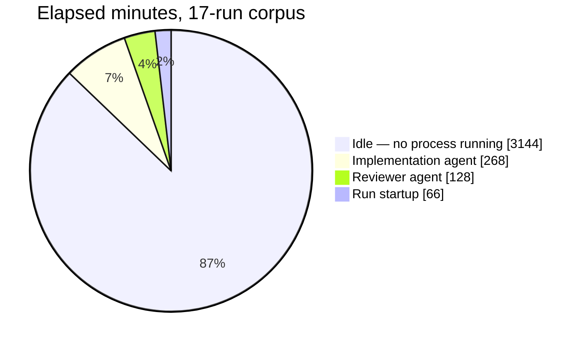

# Performance baseline and postmortem

Where the engine's time actually went across its first production corpus, and why
the obvious suspects were wrong. Recorded so that later claims of improvement have
something to be measured against.

**Measured:** 2026-08-05, over 17 runs in `~/.rosetta/sdlc-runs/` spanning
2026-08-01 to 2026-08-05. Corpus is runs against the then-only production
consumer.

## Headline

| Metric                        | Baseline                                                   |
| ----------------------------- | ---------------------------------------------------------- |
| Runs                          | 17 (16 with recoverable state)                             |
| Tasks                         | 39, of which 37 merged (95%)                               |
| Elapsed                       | 3,606 minutes                                              |
| Work observed by heartbeat    | 462 minutes → **87.2% of elapsed unobserved**              |
| Work inferred from step times | 653 minutes → **81.9% of elapsed unobserved**              |
| Escalations                   | 50 across 17 runs (**2.9 per run**), in 10 runs            |
| CI verdicts                   | 36 pass, 14 blocked, **0 failing**                         |
| Supervisor exit records       | Absent in 10 of 17; the other 7 in two incompatible shapes |

Excluding one outlier — `sdlc-cli-test-missing`, a CLI test left open for 23 hours —
gives 2,205 elapsed minutes over 16 runs, and idle of 79.7% (heartbeat) or 70.4%
(step-derived). The outlier changes the number by nine points and changes nothing
about the conclusion.

**The finding is that between 70% and 87% of the engine's wall-clock life had no
process running at all.** Whichever estimator you prefer, the dominant cost is not
the work — it is the waiting for a human to notice that work had stopped.



## Where the recoverable minutes were

Ranked by minutes attributable to each cause.

### 1. The supervisor exited on `merge-blocked` instead of retrying

28 of the 50 escalations are `merge-blocked`, and each one ended the process. The
run then waited for a human to relaunch it by hand. This single behaviour accounts
for the bulk of the idle time, including the 678-minute
`retro-and-queued-plans` run that contained 64 minutes of work.

A stopped run is indistinguishable from a slow one to anyone not watching the
terminal, which is why these gaps ran overnight rather than for minutes.

### 2. Every CI block in the corpus was missing signal, never failing CI

Of 50 CI verdicts: 36 pass, 14 blocked, **zero breach**. All 14 blocked reasons are
absence of signal, not failure:

| Blocked reason                   | Count |
| -------------------------------- | ----- |
| `commit <sha> has no check runs` | 10    |
| `no CI results for <sha>`        | 4     |

The engine pushed a branch, polled once before GitHub had registered any check
runs, recorded `blocked`, escalated, and exited. The `ci` step's total time across
the corpus was under three minutes — the engine never waited for CI, which is
precisely the bug. **There has never been a genuine CI failure in this engine's
production history**, so every minute lost to the CI gate was lost to impatience.

### 3. Reviewer disagreement was terminal

17 reviewer disagreements, each of which stopped a run cold — there was no
re-dispatch path. The reviewer itself is cheap: a median 5.9 minutes of observed
reviewer time per run, and dispatch latency well under that.

The lesson generalizes past this gate. A fast, accurate check whose failure mode is
"stop and wait for a human" contributes far more dead time than a slow check that
recovers on its own.

### 4. `emitOnce` swallowed every recurrence

The notified marker was keyed by escalation title alone, so an escalation woke a
human **exactly once, ever**. A recurrence — including the same escalation against
new content after a failed fix — was silently dropped. A run could re-escalate
repeatedly with nobody informed after the first time.

### 5. Half of all work was unobservable

Heartbeats instrumented only `starting`, `implementation`, and `reviewer`. The
`sandbox`, `verification`, `pr`, `merge` steps and the verifier agent emitted none,
which is why the heartbeat and step-derived work estimates differ by 191 minutes —
that gap _is_ the instrumentation hole.

The consequence was operational, not merely analytical: with no beat, neither a
human nor the continuity daemon could distinguish a working run from a dead one.

Compounding it, `supervise.exit` was absent in 10 of 17 runs and, where present,
appeared in two incompatible shapes — so even the terminal state of a run was
often unreadable by automation.

## Where the real work went

Of the 462 heartbeat-observed minutes:

| Step             | Minutes | Share | Median run-segment |
| ---------------- | ------- | ----- | ------------------ |
| `implementation` | 268.0   | 58.0% | 13.7 min           |
| `reviewer`       | 127.7   | 27.6% | 5.9 min            |
| `starting`       | 66.3    | 14.3% | 2.0 min            |

The distribution is unsurprising once you accept that only three steps were
instrumented. What matters is the comparison to idle: **the implementation agent —
the single most expensive component, the one it is most tempting to optimize —
accounts for 268 minutes against roughly 3,100 idle ones.** Making the agent
infinitely fast would have recovered less than a tenth of what was being lost to
waiting.

## Two disproven suspects

Both were plausible, both were measured, and both were wrong. Recorded because the
temptation to optimize them will recur.

- **Dependency install.** `bun install` totalled 6.7 seconds across 18
  invocations; the cache is always warm in a worktree on the same machine.
- **CI wait.** Under three minutes across the corpus, for the reason described
  above: the engine was not waiting for CI, it was giving up on it.

## Targets for the canary

The baseline exists to be beaten. For the first real feature run end to end:

| Metric                       | Baseline       | Target                |
| ---------------------------- | -------------- | --------------------- |
| Idle as % of elapsed         | 70–87%         | under 10%             |
| Escalations per run          | 2.9            | 0 for a clean feature |
| Human touchpoints per change | ~6             | 2                     |
| Approve → sandbox wall-clock | not measurable | recorded              |

"Not measurable" is itself a baseline finding: with `supervise.exit` absent from
most runs and four steps uninstrumented, the corpus cannot answer how long
Approve-to-sandbox took. Any run after the instrumentation work can.

## Reproducing these numbers

Methodology, stated precisely enough to re-derive rather than to trust:

- **Corpus** — every `~/.rosetta/sdlc-runs/<id>/` containing a `heartbeat.jsonl`
  with at least two beats, excluding aborted-launch directories (`.discarded`,
  `.bak`, `failed-start`), which never became runs.
- **Elapsed** — last beat minus first beat. `state.startedAt` is unusable for this
  corpus: it was added late and exists on only 5 of the runs.
- **Work, heartbeat-observed** — the sum of consecutive beat gaps of 120 seconds or
  less. The beat interval is 30 seconds, so a longer gap means no supervisor was
  beating, which is idle by definition. Attributed to the step label on the earlier
  beat of each gap.
- **Work, step-derived** — the sum of consecutive `state.steps[].completedAt`
  deltas of 30 minutes or less. Independent of heartbeat coverage, which is why it
  is the higher of the two estimates.
- **Idle** — elapsed minus work. Both estimates are reported because the true value
  lies between them: heartbeats undercount work (four steps uninstrumented), while
  step deltas overcount it (a gap between two step completions may include
  waiting).

Verdict and escalation counts come straight from `state.json`:

```bash
cd ~/.rosetta/sdlc-runs

# CI verdict distribution — the "zero failures" claim
jq -r '.verdicts[]? | select(.gate=="ci") | .outcome' */state.json | sort | uniq -c

# Why CI blocked, normalized
jq -r '.verdicts[]? | select(.gate=="ci" and .outcome=="blocked") | .reasons[]' */state.json \
  | sed 's/[0-9a-f]\{7,\}/<sha>/g' | sort | uniq -c | sort -rn

# Escalation triggers
jq -r '.exceptions[]?.trigger' */state.json | sort | uniq -c | sort -rn

# Task merge rate
jq -r '.taskResults | to_entries[]
       | if (.value.mergedSha // "") == "" then "unmerged" else "merged" end' \
  */state.json | sort | uniq -c
```

Elapsed and work per run, from heartbeats — note the fractional-second strip, which
`fromdateiso8601` requires:

```bash
cat > /tmp/hb.jq <<'JQ'
[ .[].ts | sub("\\.[0-9]+Z$"; "Z") | fromdateiso8601 ] as $t
| ([ range(1; $t | length) as $i
     | ($t[$i] - $t[$i - 1])
     | select(. > 0 and . <= 120) ] | add // 0) as $work
| { elapsed: (($t[-1] - $t[0]) / 60), work: ($work / 60) }
JQ

for hb in */heartbeat.jsonl; do
  case "$hb" in *.discarded*|*.bak*|*failed-start*) continue ;; esac
  jq -sf /tmp/hb.jq "$hb"
done | jq -s 'reduce .[] as $r ({runs: 0, elapsed: 0, work: 0};
    {runs: (.runs + 1), elapsed: (.elapsed + $r.elapsed), work: (.work + $r.work)})
  | {runs, elapsed: (.elapsed | round), work: (.work | round),
     idlePct: ((1 - .work / .elapsed) * 1000 | round / 10)}'
```

## Caveats on the corpus

Three, stated so a later comparison is not misled:

1. **`state.json` is mutated by resumes.** A run resumed days later has a later
   `updatedAt`, so any elapsed measure based on state timestamps mixes the run's
   life with its resurrection. That is why elapsed here comes from heartbeats.
2. **The corpus is one consumer's runs**, and most of them are engine
   self-development rather than application delivery. Work distribution on
   application features may differ; idle-versus-work does not depend on what was
   being built.
3. **Escalations per run understates recurrence.** Because `emitOnce` swallowed
   repeats, the recorded exception count is a floor on how often the engine
   actually wanted a human.
