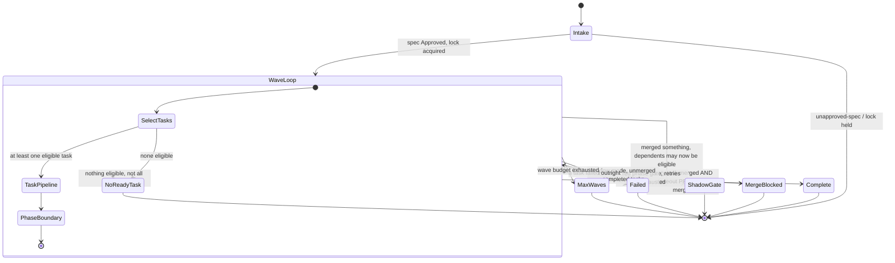
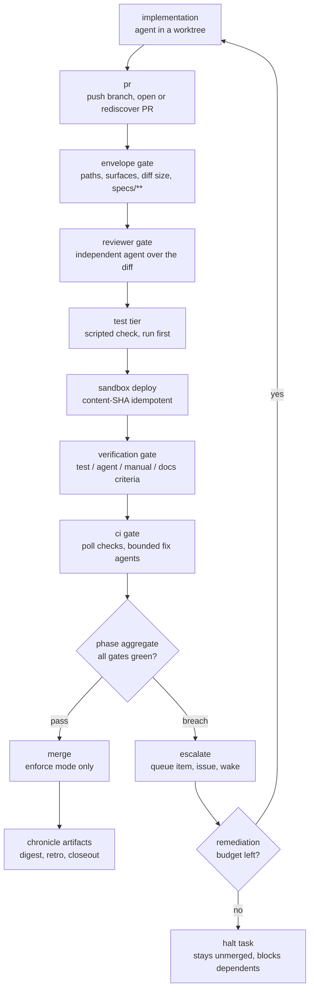

# Run lifecycle

What a run does from launch to terminal exit: the wave loop, the per-task
pipeline, and the exact set of reasons a supervisor stops.

Source: [`services/supervise.service.ts`](https://github.com/Rosetta-Foundation/rosetta_dev-scripts/blob/main/sdlc-workflow/src/services/supervise.service.ts),
[`handlers/run.handler.ts`](https://github.com/Rosetta-Foundation/rosetta_dev-scripts/blob/main/sdlc-workflow/src/handlers/run.handler.ts),
[`services/executor.service.ts`](https://github.com/Rosetta-Foundation/rosetta_dev-scripts/blob/main/sdlc-workflow/src/services/executor.service.ts).

## Two nested loops

A run has an outer loop and an inner one, and most operator confusion comes from
conflating them.

The **wave loop** belongs to `SuperviseService`. One wave is one call to
`RunHandler.runTask`, which implements every task whose dependencies are already
merged, in parallel up to `--max-parallel`. A wave ends; the supervisor re-reads
state, decides whether the phase is complete, and either starts another wave or
exits with a reason. Waves exist because dependencies are satisfied by _merges_,
so a task that depends on another cannot start until that other one has landed.

The **task pipeline** belongs to `RunHandler` and runs once per task per wave: PR,
then five gates, then aggregate, then merge, then ledger.

## Task states

A task's recorded status is one of three values, and the important thing is that
none of them means "merged":

| `TaskRunStatus` | Meaning                                                            |
| --------------- | ------------------------------------------------------------------ |
| `completed`     | The implementation agent finished and produced a branch            |
| `failed`        | The agent errored, or the engine could not produce a usable branch |
| `blocked`       | The task could not start — usually an unmerged dependency          |

Mergedness is a separate field: `mergedSha` on the task result, set either by the
enforcing merge path or by `record-merge --task`. Dependency eligibility reads
`mergedSha`, never `status`, which is why a `completed` task with a red gate
correctly blocks its dependents by simply staying unmerged.

## The task pipeline

Every step goes through the step cache, keyed by `name:taskId:inputsDigest`, where
the digest chains off the implementation digest and head SHA. A resumed run reuses
any step whose inputs are unchanged — that is what makes a kill mid-run cheap and
what guarantees a resume does not deploy the same sandbox twice.

Two ordering decisions in that diagram are deliberate and easy to get wrong if
you rearrange them:

**The test tier runs before the sandbox deploy, sequentially.** The two are
logically independent, but both typically start with a package-manager install in
the same worktree, and running them concurrently races binary linking — observed
as repeated transient `bun install EEXIST` breaches on a real run. Test tier goes
first because it is the cheaper command, so a plain test failure goes red sooner.

**The reviewer gate runs before the sandbox and CI.** Reviewer dispatch is fast
(median 1.16 minutes across the measured corpus) and a disagreement is the single
most common terminal class, so paying for a deploy before the review is wasted
work when the review rejects.

## Escalation and remediation

A red phase gate is not automatically terminal. `GateRemediationService`
re-dispatches the implementation agent with the failing gate's findings as input,
under a per-task budget persisted in `state.gateFixAttempts` — so a resume cannot
refill it. Two triggers are remediable:

- **Reviewer disagreement** — the agent gets the reviewer's concerns verbatim.
- **Envelope breach** — the agent is asked to trim scope. `maxDiffLines` is
  deliberately never auto-raised; that would defeat the gate.

The CI gate has its own older bounded fix loop, capped at three attempts
(`CI_FIX_ATTEMPT_LIMIT`). Exhausting either budget records an exception and
escalates for a human.

## Supervisor exit reasons

Every terminal exit writes `supervise.exit` in the run directory, including when
the loop throws — the record is written before the rethrow. The `kind` is what
automation branches on; the `detail` is why.

| `kind`      | `detail`            | Meaning                                                               | Operator action                                     |
| ----------- | ------------------- | --------------------------------------------------------------------- | --------------------------------------------------- |
| `completed` | `all-tasks-merged`  | Every task merged **and** a closeout PR exists that is open or merged | None; Approve the closeout PR if still open         |
| `failed`    | `task-failed`       | An implementation agent failed outright                               | Read the agent transcript in `evidence/`            |
| `failed`    | `blocked`           | The wave itself returned blocked                                      | Check dependency graph and task results             |
| `failed`    | `merge-blocked`     | Red phase gate; merge retries and remediation both exhausted          | Triage the needs-human issue, fix, resume           |
| `failed`    | `max-waves-<n>`     | Wave budget exhausted without completing                              | Usually a dependency cycle or a task stuck unmerged |
| `stopped`   | `shadow-human-gate` | Shadow mode: tasks completed, merges are human                        | Merge PRs, `record-merge`, resume                   |
| `stopped`   | `no-ready-task`     | Nothing eligible and not everything merged                            | Something is unmerged and blocking; check gates     |
| `detached`  | —                   | `--detach` handed off to a background process                         | Watch the monitor log; the run continues            |

`merge-blocked` used to be an immediate exit and was the largest single source of
idle time in the measured corpus (28 such exits across 79 waves, each waiting for
a hand relaunch). It now retries with backoff first — `state.mergeBlockedRetries`
persists the count so a relaunch cannot loop forever — and only exits when the
block is genuinely human-gated.

## Phase completion is closeout-gated

`completed` requires more than every task having a `mergedSha`. The phase's
closeout PR must also exist and be either **open** or **merged**, because the spec
is not honestly Done until its checkboxes and `status:` reflect the recorded
verdicts. Open counts because the machine has finished its part — waiting on a
human Approve is not incompleteness, and treating it as such would strand the run.
`CLOSED` unmerged does not count: someone rejected the closeout, so the phase's
documentation was deliberately not accepted.

The supervisor queries the closeout PR live on every call rather than caching it,
for exactly that reason. A `gh` failure reports the phase incomplete and writes a
monitor line naming why — failing closed, because the alternative is declaring a
phase done on the strength of a network error.

Shadow runs are exempt — they never merge for real, so they never produce a
closeout to wait for.

## Crash safety and re-entry

Three mechanisms make a killed run recoverable rather than corrupt:

- **Atomic state writes.** Every `state.json` write is temp file → fsync →
  rename, so a kill mid-write leaves the previous valid state, never a truncated
  one.
- **A single-writer run lock.** `run.lock` means a second supervisor against the
  same run refuses to start rather than interleaving writes. This is what makes a
  continuity-daemon relaunch safe: if the original is somehow alive, the relaunch
  loses the lock and exits.
- **The step cache.** Resuming re-derives each step's inputs digest and reuses
  the recorded result when it matches. Unchanged work is not repeated; changed
  work is re-judged.

The continuity daemon is what actually performs the relaunch when a supervisor pid
is dead while the run is unfinished — see [wake and escalation](wake-escalation.md).
