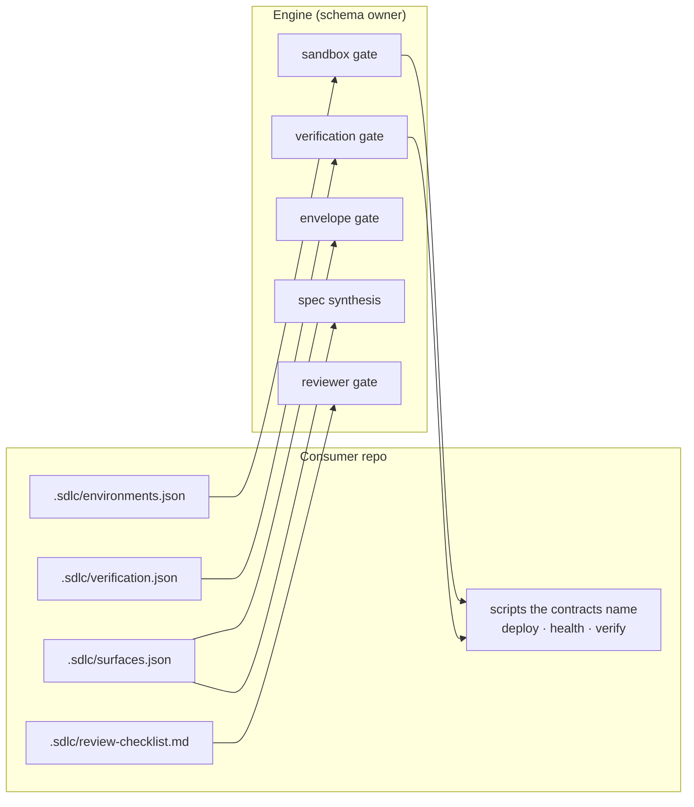

# `.sdlc/` contract reference

Everything a repo must declare to be driven by the SDLC engine, with JSON Schemas
and worked examples. These files are the seam described in
[ADR-0009](../ADR-0009-platform-boundary-mechanism-vs-policy.md): the engine owns
their _schemas_, the consuming repo owns their _contents_.

Onboarding a repo is these files plus the scripts they name. It is not an engine
change, and if it ever turns out to be one, that is a boundary bug.

## What the engine reads

Four files, at fixed paths relative to the repo root. Every one is optional, and
absence degrades gracefully rather than failing the run — but the degradation is
different in each case, and knowing which is which is the difference between a repo
that is merely unconfigured and one that is silently unverified.

| Path                        | Read by                                       | Absent means                                                                                                |
| --------------------------- | --------------------------------------------- | ----------------------------------------------------------------------------------------------------------- |
| `.sdlc/environments.json`   | `SandboxDeployService`                        | Sandbox gate reports `blocked`, non-escalating — no deploy is attempted, and merges no longer imply deploys |
| `.sdlc/verification.json`   | `VerificationService`                         | `test:` criteria degrade to `human-required`                                                                |
| `.sdlc/surfaces.json`       | `EnvelopeGateService`, `SpecSynthesisService` | Any `forbiddenSurfaces` label is unresolvable, which is an envelope **breach**                              |
| `.sdlc/review-checklist.md` | `ReviewerGateService`                         | Reviewer prompt carries the upstream default only                                                           |



## `.sdlc/environments.json`

Declares the sandbox. **Only the `sandbox` key is ever read** — there is
deliberately no API to fetch any other environment, so no code path through the
deployer can reach production. Extra keys are allowed and ignored, which lets a repo
keep other environment metadata here without widening the engine's reach.

```json
{
  "$schema": "http://json-schema.org/draft-07/schema#",
  "type": "object",
  "properties": {
    "sandbox": {
      "type": "object",
      "required": ["deployCommand", "healthCommand"],
      "properties": {
        "deployCommand": { "type": "string" },
        "healthCommand": { "type": "string" },
        "timeoutMinutes": { "type": "number", "default": 45 }
      }
    }
  }
}
```

A `sandbox` entry missing either command is a `CONTRACT_MALFORMED` error rather than
a silent skip — a half-declared sandbox is a mistake, not a configuration.

**Example** (consumer app repo):

```json
{
  "sandbox": {
    "deployCommand": "bash scripts/sdlc/sandbox-deploy.sh",
    "healthCommand": "bash scripts/sdlc/sandbox-health.sh",
    "timeoutMinutes": 30
  }
}
```

### The deploy/health protocol

The engine's side of the contract is three facts:

- **`SDLC_SANDBOX_SHA`** is exported to both commands: the task worktree head.
- **The deploy command runs in the task worktree.** Its exit code is the deploy
  verdict.
- **The health command must echo `SDLC_SANDBOX_SHA` verbatim in its output.** This
  is what makes the health check content-level rather than liveness-level: a stale
  build answering 200 fails, because the SHA it reports is not the one deployed.

Everything else is the repo's business. Whether "deploy" means a workflow dispatch,
a container push, or a no-op is policy. A repo is free to decide that a docs-only
diff needs no deploy at all and self-report the SHA — a consumer app does
exactly that with its own `sandbox-deploy-ignore.yml`, a file the engine has never
heard of.

## `.sdlc/verification.json`

The scripted check for `test:`-tier acceptance criteria.

```json
{
  "$schema": "http://json-schema.org/draft-07/schema#",
  "type": "object",
  "required": ["testCommand"],
  "properties": {
    "testCommand": { "type": "string" }
  }
}
```

**Example:**

```json
{
  "testCommand": "bash scripts/sdlc/verify-task.sh"
}
```

The command runs once per task in the worktree; a zero exit passes every test-tier
criterion for that task, and its output is saved as `<task>-test-output` evidence.
Deciding _what_ to run — which workspaces, which scripts, whether to scope by
changed paths — is the repo's, and is usually worth a wrapper script rather than a
long inline command.

## `.sdlc/surfaces.json`

Maps a surface **label** to path globs. Labels are the vocabulary a spec's
`forbiddenSurfaces` draws from, and the whole point is that the engine's gate logic
never hardcodes one.

```json
{
  "$schema": "http://json-schema.org/draft-07/schema#",
  "type": "object",
  "additionalProperties": {
    "type": "array",
    "items": { "type": "string" }
  }
}
```

**Example** (abridged, consumer app repo):

```json
{
  "ci-config": [".github/workflows/**"],
  "auth": [
    "packages/app/backend/src/handler/auth/**",
    "packages/app/frontend/src/hooks/useAuth.ts"
  ],
  "payments-phi-boundary": [
    "packages/app/backend/src/utility/stripe-phi-boundary.ts",
    "packages/app/backend/src/handler/billing/**"
  ],
  "production-deploy": ["scripts/deploy-organization.sh"]
}
```

`payments-phi-boundary` is a good illustration of the boundary rule. The label is
meaningless to the engine, which knows only "labels resolve to globs and forbidden
globs must not be touched." The healthcare judgement that Stripe metadata is a PHI
boundary lives entirely in this file, in the repo that has PHI obligations.

Two behaviours to know:

- **The gate reads this file as committed at the ref under judgement**, never from
  the operator's working tree. A locally edited surface map cannot sway a verdict.
- **An unresolvable label is a breach, not a pass.** Fail closed: an unknown label
  is never treated as unrestricted, and a missing contract with non-empty
  `forbiddenSurfaces` breaches with a reason naming what it could not resolve.

## `.sdlc/review-checklist.md`

Domain review rules injected into the reviewer prompt. Markdown, not JSON, because
the content is prose for a model.

Each list item becomes a numbered checklist item in the prompt, and the reviewer
returns a per-item finding (`pass` / `fail` with a rationale) joined back by
1-based index. Mark an item mandatory to make a failure block rather than advise.

```markdown
# Review checklist

- **(mandatory)** Never log a patient identifier, even at debug level.
- **(mandatory)** Any new Stripe metadata field is reviewed against the PHI boundary.
- Prefer an existing repository over a new SDK client.
```

Omitting the file reproduces the pre-checklist prompt byte-for-byte, which is a
deliberate no-regression property: adding the seam did not change behaviour for
repos that do not use it.

This file is also the answer to "where does my domain rule go?" The upstream prompt
stays domain-neutral on purpose — see
[ADR-0009](../ADR-0009-platform-boundary-mechanism-vs-policy.md) §3.

## Contracts the engine does not read

A repo will accumulate its own SDLC-adjacent config, and it is worth keeping the
distinction visible. Example from a consumer app:

| File                              | Read by                                                     |
| --------------------------------- | ----------------------------------------------------------- |
| `.sdlc/sandbox-deploy-ignore.yml` | The repo's own deploy script — paths that never need a ship |
| `.sdlc/verify-scripts.json`       | The repo's own verify script — per-workspace script lists   |

Neither has an engine schema, because neither is an engine concern. If one of them
ever _needs_ to be, the fix is to add an engine seam and a schema for it — not to
teach the engine about this repo's file.

## Onboarding checklist

1. Write `.sdlc/surfaces.json` first. It is the one whose absence causes a breach
   rather than a graceful degradation, and spec synthesis needs it to ground labels.
2. Write `.sdlc/verification.json` and the script it names. Verify by hand that the
   command exits zero on a clean tree.
3. Write `.sdlc/environments.json` and its two scripts. Verify the health command
   echoes `SDLC_SANDBOX_SHA`, then verify it _fails_ against a stale deploy — a
   health check that cannot fail is not a check.
4. Optionally add `.sdlc/review-checklist.md`.
5. Run one spec in shadow mode (`--shadow`) before enforce. Every gate runs and
   records; nothing merges. Read the verdicts and confirm the gates say what you
   expected about a diff you already understand.
