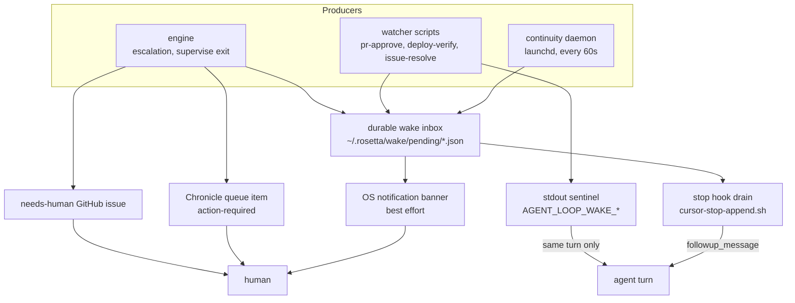

# Wake and escalation architecture

The engine can only be autonomous if it can reliably get a human's attention and
reliably resume itself. Both turn out to be harder than the code that does the
actual work, and this layer is where most of the engine's real-world idle time was
lost.

Source: [`scripts/wake-inbox.sh`](https://github.com/Rosetta-Foundation/rosetta_dev-scripts/blob/main/team-setup/templates/root/scripts/wake-inbox.sh),
`scripts/wake-drain.sh`, `scripts/sdlc-continuity-daemon.sh`,
[`repositories/wake-inbox.repository.ts`](https://github.com/Rosetta-Foundation/rosetta_dev-scripts/blob/main/sdlc-workflow/src/repositories/wake-inbox.repository.ts),
`services/escalation.service.ts`.

## The problem this layer exists to solve

Three independent facts about the environment, each of which silently breaks the
obvious design:

1. **A watcher started from an agent tool call dies with that tool call.** A
   `while true` loop in a chat terminal dies with the chat. So "poll in the
   background" is not durable.
2. **`notify_on_output` cannot start a turn after the turn that armed it ended.**
   A sentinel printed to a terminal reaches an agent only if an agent is already
   watching that terminal, in that turn. A wake printed while nobody is listening
   is simply lost.
3. **A human who walked away is not watching anything.** Chat is idle; no turn is
   in flight; nothing will start one.

The consequence, observed repeatedly before this layer existed: a run stops, an
escalation prints, and the pipeline sits idle for hours because the signal had no
durable home. In the measured corpus, 62.7% of elapsed time had no supervisor
process running at all, including one 535-minute overnight gap.

## Three delivery paths, deliberately redundant



The redundancy is the design, not accretion. Each path fails in a different way:
the sentinel needs a listening agent, the inbox needs a turn to end, the issue
needs someone to look at GitHub, the banner needs the human to be at the machine.
Together they cover idle chat, dead terminals, and a closed laptop.

## The durable wake inbox

A wake is a file, not a line of output:

```
$ROSETTA_WAKE_DIR/pending/<slug>.json     unread
$ROSETTA_WAKE_DIR/consumed/<slug>.json    drained, kept for audit
```

Default root is `~/.rosetta/wake`. There are two producers of the same format — a
shell function (`wake_emit`) and a TypeScript repository (`WakeInboxRepository`) —
because the engine and the watcher scripts both need to emit and neither should
depend on the other.

A wake record carries `kind`, `dedupeKey`, `prompt` (the instruction handed to the
agent), and arbitrary `data`. The engine emits three kinds:

| Kind                | Emitted when                                              |
| ------------------- | --------------------------------------------------------- |
| `sdlc_escalation`   | A gate exception needs a human — one per escalation title |
| `sdlc_supervisor`   | A supervisor reached a terminal exit                      |
| `sdlc_queue_launch` | A queued run was launched from the durable launch queue   |

Watcher scripts add their own (`pr_approve`, `deploy_verify`, `issue_resolve`), and
those also print the matching `AGENT_LOOP_WAKE_*` sentinel for the same-turn path.

### `emit` versus `emitOnce`, and the bug that motivated the distinction

`emit` overwrites the pending file for `(kind, dedupeKey)`. `emitOnce` suppresses a
repeat of the same `(kind, dedupeKey, occurrenceKey)` triple.

The `occurrenceKey` component was not in the original design, and its absence was a
genuine silent-failure bug: the notified marker was keyed by `dedupeKey` alone, so
an escalation title woke a human **exactly once, ever**. Every recurrence of the
same escalation — including the same escalation against entirely new content after
a fix attempt — was swallowed with no trace.

Now the occurrence key is typically the failing verdict's inputs digest or the task
head SHA, which gives the behaviour you actually want on both sides: resuming a run
stays quiet (same content, same escalation), while the same escalation against a new
head SHA notifies again (the fix did not work, and you need to know).

The pending file itself stays keyed by `(kind, dedupeKey)` so a recurring problem
overwrites rather than piling up N files for one issue — only the marker carries the
occurrence.

## Stop-hook re-entry

The Cursor stop hook is the only mechanism that can deterministically _start_ a new
agent turn after the previous one ended.

`cursor-stop-append.sh` runs at the end of every agent turn, drains the inbox, and
returns the drained prompts as a `followup_message`, which re-enters the agent. That
converts "an agent will hopefully notice" into "the agent is re-entered."

Draining is a claim: each pending file is `mv`'d to `consumed/` before printing, and
whichever drainer wins the rename owns the wake. Two hooks firing at once therefore
cannot hand the same wake to two turns.

Two independent stop conditions prevent an infinite re-entry loop, because the hook
is configured with no cap from Cursor (`loop_limit: null`):

1. **Draining is destructive.** A drained inbox is empty, so the next stop emits
   `{}` and the loop ends by itself.
2. **`LOOP_CAP`** (default 12, `ROSETTA_WAKE_LOOP_CAP`) is a backstop for a
   producer that refills the inbox on every tick.

An aborted or errored turn returns no followup: the human hit stop or something
broke, and resuming would fight the operator. The wakes stay pending for next time.

## Escalation: three destinations for one exception

`EscalationService` turns each `ExceptionEntry` into up to three durable records,
all keyed by the same title (`ACTION REQUIRED: SDLC <runId> <taskId> — <trigger>`):

- **A Chronicle queue item** tagged `action-required`, `trigger:<trigger>`,
  `task:<id>`, plus truncated context and evidence links. This is the ledger-first
  entry point.
- **A `needs-human` GitHub issue** in the repo under work, assigned to the
  configured operator. When no operator is configured the issue is still posted and
  a warning goes to the monitor log — an unassigned issue is worse than a missing
  assignee only if nobody notices, so it says so.
- **A durable wake** via `emitOnce`, so the escalation survives a dead terminal.

Each destination independently reports whether it newly delivered anything, and the
service only counts the escalation as posted when at least one of them did. Re-posting
an existing queue item or issue is a no-op, which is what makes escalation safe to
call on every resume.

## The continuity daemon

The last resort, and the only component that runs with no agent, no terminal, and no
human present. A launchd job ticks it every 60 seconds. Each tick:

1. **Relaunch dead supervisors.** A run whose `supervise.pid` is dead while the run
   is unfinished gets relaunched from its `launch.json` — the recorded argv,
   `execArgv`, `execPath`, and cwd, so the relaunch reproduces the original process
   exactly.
2. **Kill hung implementation agents.** An agent that has not touched its heartbeat
   in `SDLC_AGENT_STALL_SECONDS` (default 2400) is hung rather than slow.
3. **Wake on resolved blockers.** When a `needs-human` issue is closed, the run that
   escalated it becomes resumable, and the daemon wakes an agent to resume it.

Three guards keep the daemon from doing harm, each learned from it doing exactly the
harm in question:

- **Unresolved blockers are not relaunched.** A supervisor that exited because a
  blocked task was genuinely unresolvable is not crashed — relaunching it reproduces
  the identical exit within seconds, on every tick, forever. The daemon checks
  whether the run's recorded exceptions have matching closed issues first.
- **Abandoned runs get a wake, not a relaunch.** Only runs active within
  `SDLC_ABANDONED_SECONDS` (default 7200) are auto-relaunched. Resurrecting
  yesterday's abandoned experiment burns tokens and opens PRs nobody asked for, so
  older runs wake a human and let them decide.
- **Everything the daemon wants an agent to do goes to the inbox**, never to stdout.
  A launchd job's stdout has no reader.

The run lock is what makes relaunching safe in the first place: if the original
supervisor is somehow still alive, the relaunched process loses the lock and exits
rather than interleaving writes to `state.json`.

## Known limitation

The launchd label is `com.rosetta.sdlc-daemon` — a machine-global constant. Two
workspaces on one machine cannot both run a continuity daemon; installing from the
second evicts the first. Paths are derived from the installer's own location, so the
only blocker is the label. Recorded as a boundary violation in
[ADR-0009](../ADR-0009-platform-boundary-mechanism-vs-policy.md) §7, and not
load-bearing while one workspace runs one daemon — which is precisely how it
survived this long.
