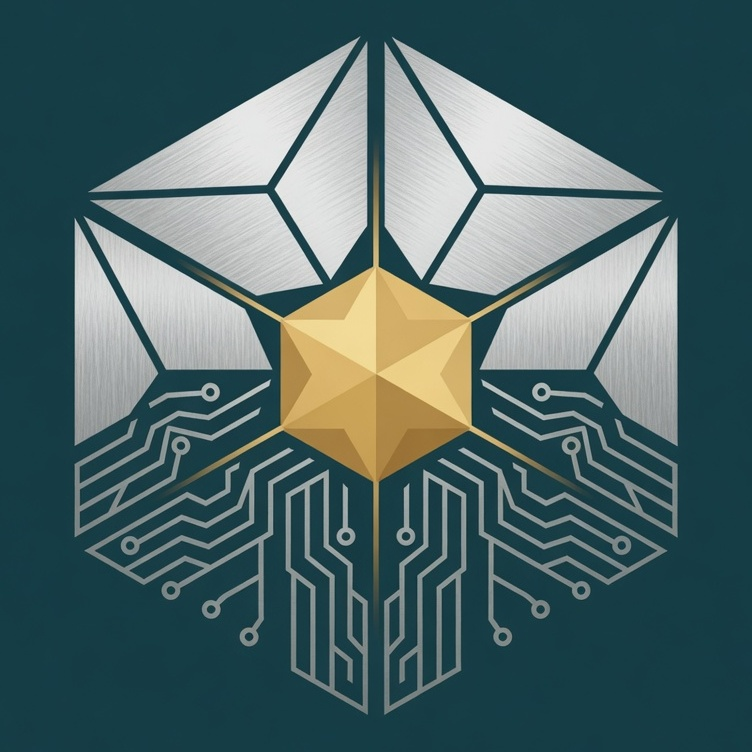

# Foundations

> _"Every commit tells part of the story. Rosetta remembers the rest."_

> **Note:** this is the **engineering-era origin story** — how Rosetta began
> and the philosophy of its first domain. The project's constitution — the
> wider founding context, manifesto, principles, glossary, and settled
> decisions — lives in [`foundations/`](../foundations/README.md). Engineering
> is the first domain, not the boundary.

---

# Why Rosetta Exists

Rosetta began with a simple observation:

Modern software engineering creates an enormous amount of valuable knowledge, yet organizations retain surprisingly little understanding.

Every day engineers produce:

- source code
- pull requests
- Jira tickets
- architecture discussions
- AI conversations
- documentation
- incident investigations
- design reviews
- Slack threads
- meeting notes

Each artifact captures a small piece of organizational understanding.

Almost none of them preserve the complete story.

Months later we remember **what** changed, but often lose:

- why it changed
- what alternatives were considered
- which production issue motivated the work
- who investigated it
- which business rule influenced the decision
- what assumptions were made

Rosetta exists to preserve those missing connections.

---

# The Observation

Documentation is not the problem.

Documentation is a symptom.

The real problem is that engineering knowledge is fragmented.

The organization already possesses the answers.

They're simply scattered across dozens of systems.

Git knows part.

Jira knows part.

Slack knows part.

Claude knows part.

Confluence knows part.

People know part.

Rosetta exists to connect those fragments into understanding.

---

# The Philosophy

Rosetta is built on a simple belief:

> Engineering activity should automatically become organizational knowledge.

Engineers should not be expected to duplicate their effort by writing documentation after they've already done the work.

Documentation should increasingly become a byproduct of engineering.

Not an additional task.

---

# The Name

The Rosetta Stone became valuable because it connected multiple representations of the same information.

It did not invent knowledge.

It revealed relationships.

Rosetta follows the same philosophy.

It translates between:

- source code
- business intent
- architecture
- documentation
- AI reasoning
- organizational memory

Its purpose is understanding.

---

# The Products

Rosetta is intentionally designed as a platform.

Not an application.

---

## Chronicle

Chronicle captures engineering activity.

Its responsibility is memory.

Chronicle continuously transforms engineering work into structured organizational knowledge.

Chronicle should remain presentation-agnostic.

Everything else consumes Chronicle.

---

## Wayfinder

Wayfinder helps engineers navigate organizational knowledge.

Its responsibility is understanding.

Rather than asking:

> "Where is the documentation?"

Wayfinder should answer:

> "Here's how this system works."

Wayfinder consumes Chronicle rather than replacing documentation.

---

# The Guiding Principle

Rosetta is not building a better wiki.

Rosetta is building an engineering memory system.

Knowledge should survive:

- reorganizations
- promotions
- resignations
- changing AI models
- changing documentation systems
- changing repositories

Institutional memory should outlive the tools that created it.

---

# The AI Principle

Artificial intelligence changes the economics of knowledge.

Historically:

Documentation had to be written.

Now:

Documentation can increasingly be generated.

The scarce resource is no longer documentation.

The scarce resource is **high-quality context**.

Rosetta's purpose is to create and preserve that context.

---

# The Human Principle

Rosetta is not an AI project.

Rosetta is a human project that uses AI.

The goal is not to automate engineers.

The goal is to amplify engineering organizations.

Everything Rosetta produces should benefit both:

- humans
- AI systems

Neither should be treated as a secondary consumer.

---

# Design Principles

## Private by Default, Shared by Intention

Knowledge is born personal.

Engineers own their thoughts. What becomes part of the organization's collective memory is their decision, made deliberately — never by default, never automatically.

This is not only a privacy stance. It respects authorship. Empowering the individual is what makes the shared organizational memory trustworthy enough to build a stronger engineering culture on.

---

## Evidence First

Generated knowledge must always be traceable back to evidence.

Trust is earned through provenance.

---

## Source Driven

Never ask an engineer to manually duplicate work.

Whenever possible, derive understanding directly from engineering activity.

---

## Durable

Knowledge should improve over time.

Historical context should accumulate rather than disappear.

---

## Extensible

Chronicle should expose structured knowledge.

Other systems should build experiences on top of it.

---

## AI Native

AI is not a feature.

AI is one of the primary consumers of organizational knowledge.

---

## Human Centered

Engineering organizations exist for people.

AI should increase human capability rather than replace human judgment.

---

# Long-Term Vision

Imagine asking:

> Why was this architecture chosen?

Rosetta should answer.

Imagine asking:

> What production incident caused this business rule?

Rosetta should answer.

Imagine asking:

> Who investigated this issue two years ago?

Rosetta should answer.

Imagine onboarding a new engineer.

Instead of reading hundreds of disconnected documents...

They simply begin a conversation.

Rosetta provides the context.

Wayfinder provides the guidance.

Chronicle provides the memory.

---

# What Success Looks Like

Rosetta succeeds when engineering organizations stop worrying about losing knowledge.

When promotions no longer require reconstructing months of accomplishments.

When onboarding takes days instead of months.

When AI assistants understand organizational context as well as senior engineers.

When architecture decisions remain understandable years later.

When institutional knowledge survives organizational change.

When engineers spend more time building and less time remembering.

---

# Inspirations

Rosetta is influenced by many ideas rather than a single source.

Among them:

- The observation that documentation becomes stale because it is disconnected from engineering activity.
- Experiences onboarding onto complex engineering teams where understanding the system was harder than understanding the code.
- Engineering organizations increasingly adopting AI without corresponding improvements to organizational memory.
- The belief that developer productivity is fundamentally a knowledge problem rather than a tooling problem.
- The realization that every engineering artifact captures part of a story, but no existing system captures the story itself.

Rosetta exists to connect those stories.

---

# Stewardship

Rosetta should always remember its original purpose.

Not building AI.

Not building documentation.

Not building another developer portal.

Its purpose is stewardship.

To preserve, organize, and continuously improve the collective understanding of an engineering organization.

Technology will change.

Programming languages will change.

AI models will change.

Organizational knowledge should not.

---

# Closing Thought

Every organization has forgotten more than it realizes.

Rosetta exists so it doesn't have to.
